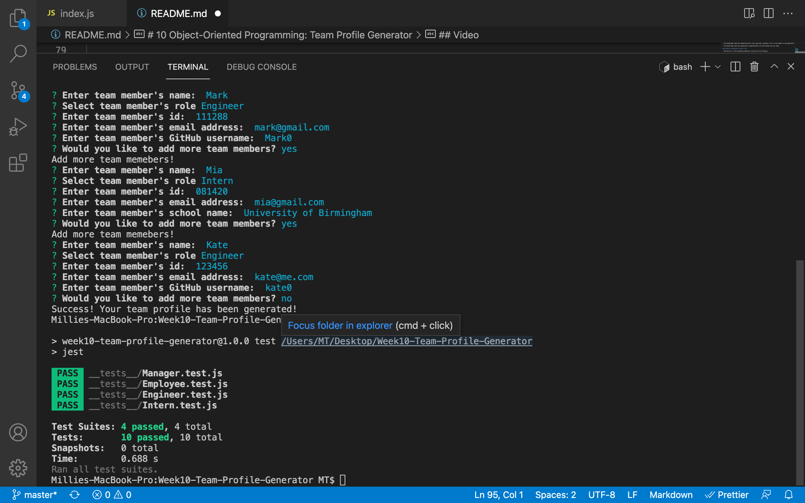
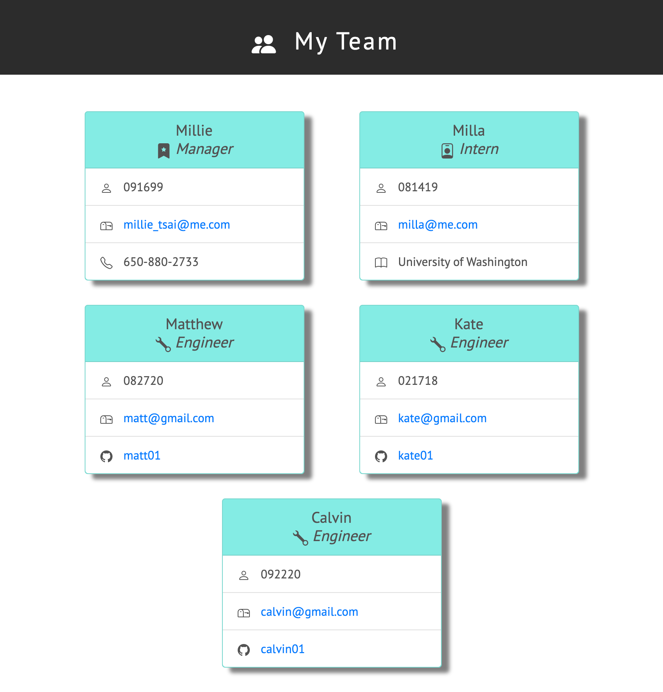

# 10 Object-Oriented Programming: Team Profile Generator

## Description

Build a Node.js command-line application that takes in information about employees on a software engineering team, then generates an HTML webpage that displays summaries for each person. I also write a unit test for every part of my code to ensure that it passes each test.

### User Story

```md
AS A manager
I WANT to generate a webpage that displays my team's basic info
SO THAT I have quick access to their emails and GitHub profiles
```

### Acceptance Criteria

```md
GIVEN a command-line application that accepts user input
WHEN I am prompted for my team members and their information
THEN an HTML file is generated that displays a nicely formatted team roster based on user input
WHEN I click on an email address in the HTML
THEN my default email program opens and populates the TO field of the email with the address
WHEN I click on the GitHub username
THEN that GitHub profile opens in a new tab
WHEN I start the application
THEN I am prompted to enter the team manager’s name, employee ID, email address, and office number
WHEN I enter the team manager’s name, employee ID, email address, and office number
THEN I am presented with a menu with the option to add an engineer or an intern or to finish building my team
WHEN I select the engineer option
THEN I am prompted to enter the engineer’s name, ID, email, and GitHub username, and I am taken back to the menu
WHEN I select the intern option
THEN I am prompted to enter the intern’s name, ID, email, and school, and I am taken back to the menu
WHEN I decide to finish building my team
THEN I exit the application, and the HTML is generated
```

## Technology Used

- Uses [Jest](https://www.npmjs.com/package/jest) for running the unit tests
- [Inquirer](https://www.npmjs.com/package/inquirer) for collecting input from the user. The application will be invoked by using the following command:

```bash
node index.js
```

## License

[](https://opensource.org/licenses/MIT)

### Video

- Build Team Profile Demo (Please click screenshot to watch the video)
  [](https://drive.google.com/file/d/1g4h9gE66yb013y91J39bK_e-48-ehhn2/view?usp=sharing)

- Run Test Demo (Please click screenshot to watch the video)
  [](https://drive.google.com/file/d/1RXt_rKYd3YXcN9edgOKrMFz9WRec87Ul/view?usp=sharing)

### Screenshot

- Landscape Mode
  

- Portrait Mode
  
  © 2021 Trilogy Education Services, LLC, a 2U, Inc. brand. Confidential and Proprietary. All Rights Reserved.
