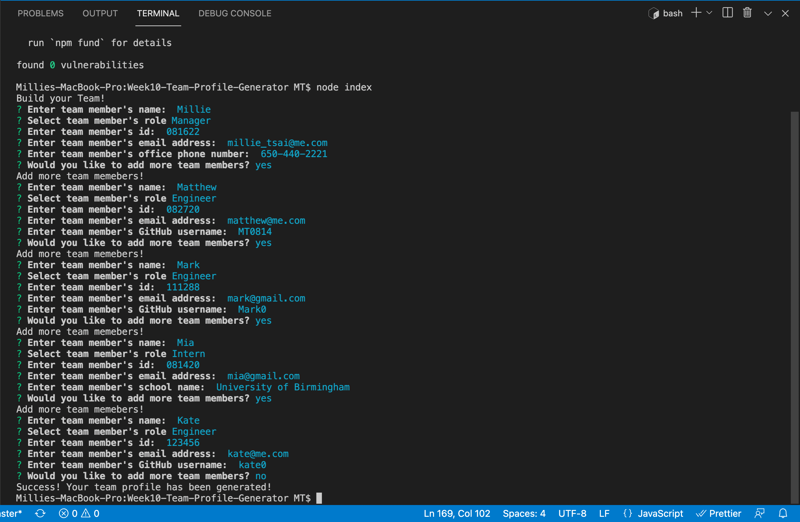

# 10 Object-Oriented Programming: Team Profile Generator

[](https://opensource.org/licenses/MIT)

## Description

Build a Node.js command-line application that takes in information about employees on a software engineering team, then generates an HTML webpage that displays summaries for each person. I also write a unit test for every part of my code to ensure that it passes each test.

## User Story

```md
AS A manager
I WANT to generate a webpage that displays my team's basic info
SO THAT I have quick access to their emails and GitHub profiles
```

## Acceptance Criteria

```md
GIVEN a command-line application that accepts user input
WHEN I am prompted for my team members and their information
THEN an HTML file is generated that displays a nicely formatted team roster based on user input
WHEN I click on an email address in the HTML
THEN my default email program opens and populates the TO field of the email with the address
WHEN I click on the GitHub username
THEN that GitHub profile opens in a new tab
WHEN I start the application
THEN I am prompted to enter the team manager’s name, employee ID, email address, and office number
WHEN I enter the team manager’s name, employee ID, email address, and office number
THEN I am presented with a menu with the option to add an engineer or an intern or to finish building my team
WHEN I select the engineer option
THEN I am prompted to enter the engineer’s name, ID, email, and GitHub username, and I am taken back to the menu
WHEN I select the intern option
THEN I am prompted to enter the intern’s name, ID, email, and school, and I am taken back to the menu
WHEN I decide to finish building my team
THEN I exit the application, and the HTML is generated
```

## Technology Used

- Uses [Jest](https://www.npmjs.com/package/jest) for running the unit tests
- [Inquirer](https://www.npmjs.com/package/inquirer) for collecting input from the user. The application will be invoked by using the following command:

```bash
node index.js
```

Starts with a directory structure that looks like the following example:

```md
├── **tests**/ //jest tests
│ ├── Employee.test.js
│ ├── Engineer.test.js
│ ├── Intern.test.js
│ └── Manager.test.js
├── dist/ // rendered output (HTML) and CSS style sheet  
├── lib/ // classes
├── src/ // template helper code
├── .gitignore // indicates which folders and files Git should ignore
├── index.js // runs the application
└── package.json
```

### Walkthrough Video: 32%

- A walkthrough video that demonstrates the functionality of the Team Profile Generator and passing tests must be submitted, and a link to the video should be included in your README file.

- The walkthrough video must show all four tests passing from the command line.

- The walkthrough video must demonstrate how a user would invoke the application from the command line.

- The walkthrough video must demonstrate how a user would enter responses to all of the prompts in the application.

- The walkthrough video must demonstrate a generated HTML file that matches the user input.

### Technical Acceptance Criteria: 40%

- Satisfies all of the preceding acceptance criteria plus the following:

  - Uses the [Inquirer package](https://www.npmjs.com/package/inquirer).

  - Uses the [Jest package](https://www.npmjs.com/package/jest) for a suite of unit tests.

  - The application must have `Employee`, `Manager`, `Engineer`, and `Intern` classes.

## Video

-Build Team Profile Demo (Please click screenshot to watch the video)
[](https://drive.google.com/file/d/1cQC4N5FSpRfQCaVOR2YtOhCpBrwFiH52/view?usp=sharing)

-Run Test Demo (Please click screenshot to watch the video)
[](https://drive.google.com/file/d/14as434YUhvMEFDEzNKS_K2SLE4QoiWh_/view?usp=sharing)

© 2021 Trilogy Education Services, LLC, a 2U, Inc. brand. Confidential and Proprietary. All Rights Reserved.
